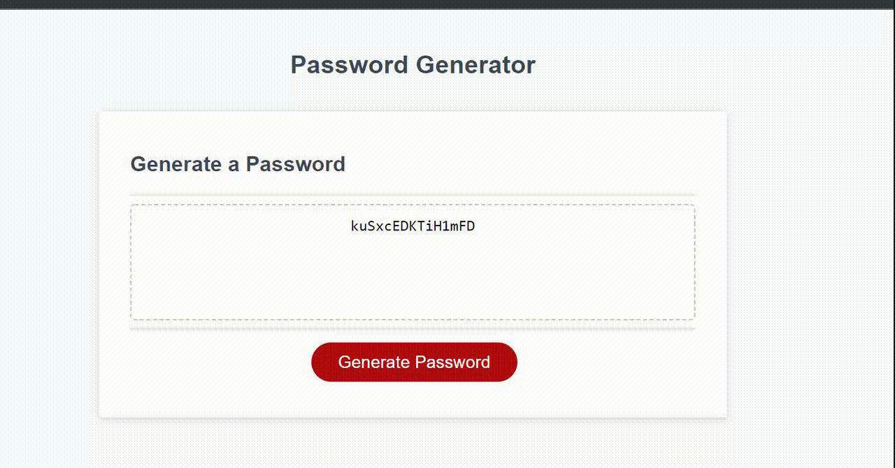

# Random Password Generator

## Table of Contents
- [Description](#description)
- [Visuals](#visuals)
- [Links](#links)

## Description

This is a random password generator that I have added on a javascript function to generate a password based on the characters and length the user wants to use. I did this by using if statements to ask wether the user wants to use, for example, numbers or special characters, etc.

## Visuals

## Links

Deployed Site : (https://buggiess.github.io/password-generator/)